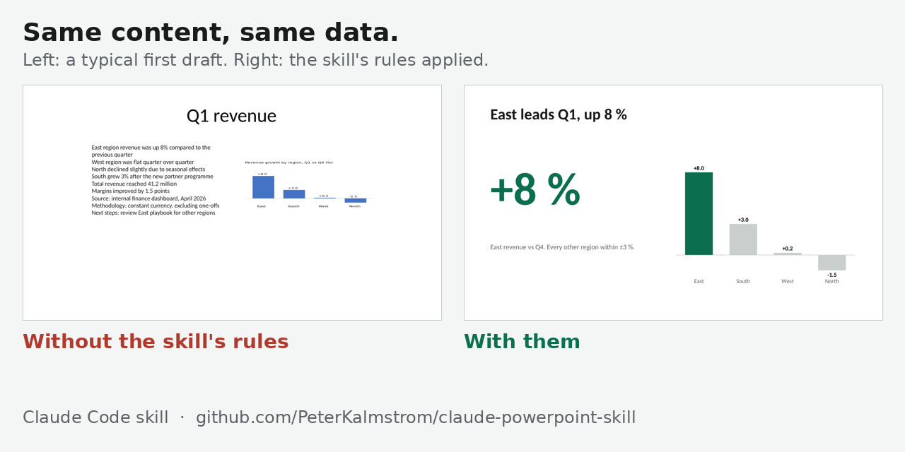
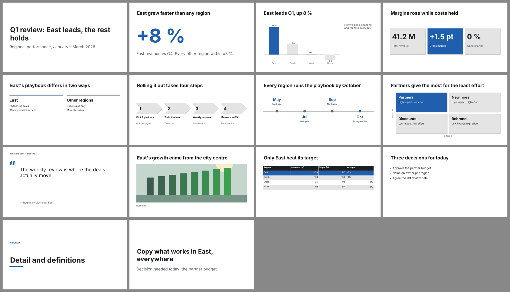
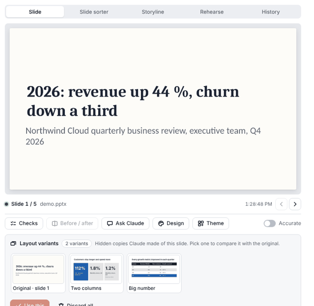

# Claude PowerPoint Skill

**Make Claude Code build slides that actually look right — not just slides that "succeeded".**



Claude can write a .pptx in seconds. What it can't do on its own is notice that the text overflowed, the chart
got squashed, or the title says nothing. This skill gives Claude the rules for slides people actually present,
and makes it **render each slide, look at it, and fix it** before calling it done.

- **Claim titles, not topic labels** — "East leads Q1, up 8 %" instead of "Q1 revenue"
- **Word budgets and an 18 pt floor** — no 60-word bullet walls; the depth goes in the speaker notes
- **Render → look → fix** — the tool saying `success: true` is not evidence; the rendered slide is
- **A deck linter that runs anywhere** — text overflow, overlaps, stretched pictures, small text, missing alt text, unsourced figures
- **Works on any OS** with python-pptx; on Windows it also drives live PowerPoint for pixel-exact renders

```bash
git clone https://github.com/PeterKalmstrom/claude-powerpoint-skill ~/.claude/skills/building-powerpoint-decks
```

Then ask Claude Code: *"Make a 6-slide deck from notes.md"* — or *"Review deck.pptx before my talk"*.

Or build one yourself from a spec — [`examples/spec/sample-deck.json`](examples/spec/sample-deck.json) has every slide pattern:

```bash
uvx --with python-pptx --with pillow python scripts/build_deck.py examples/spec/sample-deck.json --out deck.pptx --lint
```



---

## How it works

Claude loads a short `SKILL.md` (under 500 lines) with a start-here table, ten core rules, the build loop and a
table of known silent failures. Detailed guidance lives in [`reference/`](reference/) and is opened only when the
task needs it, so the skill costs little context until it's used.

```
1. Build or edit with an idempotent script (named shapes, rebuild instead of patch)
2. Render the slide
3. LOOK at the render                  ← the step agents skip
4. Critique it against the rules and the defect catalogue
5. Fix and go back to 2 — or save
```

Every rule comes with *why* (the incident that caused it) and *how to apply it*, so Claude can judge edge cases
instead of pattern-matching. See the [before/after example](examples/before-after/README.md) for the rules applied
to one slide.

### Example session (Windows, live PowerPoint)

> **You:** Add a hero-stat slide showing "3.2°C — projected warming by 2100" to the deck I have open.
>
> **Claude:** *(loads `building-powerpoint-decks`)* Before I touch the file, I'm making a timestamped backup —
> bulk edits live outside PowerPoint's undo stack. This is a "hero stat" slide: one big number, ~5 visible words,
> number 120 pt, unit 28 pt, caption 18 pt. *(finds the deck by name rather than trusting `ActivePresentation`,
> builds the slide, names every shape, renders it)* Looking at the render: no wrap, balanced top and bottom. The
> IPCC citation with its DOI is in the speaker notes. Ready to save?
>
> **You:** Ship it.

The skill's contribution is everything Claude did that you didn't ask for: the backup, the layout choice, naming
the shapes, rendering and looking, putting the citation in the notes.

---



*PowerPoint Live, the skill's MCP App: the deck updates live while Claude works - changed shapes light up, compare before/after, fix lint findings with one click, rearrange in the sorter, rehearse with timers.*

## Benchmark

Blind-judged against plain Claude and Anthropic's pptx skill on three briefs (details, method and the round this
skill lost: [evals/benchmark](evals/benchmark/README.md)):

| Maker | Overall (1-10) | Legibility | Layout | Speaker notes | Lint errors / warnings (3 decks) |
|---|---|---|---|---|---|
| **This skill** | **8.56** | **9.0** | **9.0** | **8.7** | **0 / 0** |
| Plain Claude | 7.33 | 6.7 | 8.0 | 6.0 | 30 / 135 |
| Anthropic pptx skill | 6.11 | 5.7 | 7.7 | 2.0 | 15 / 81 |

## What runs where

| Mode | Needs | You get |
|---|---|---|
| **Any OS** (Linux, macOS, Windows, CI) | Python + [`python-pptx`](https://python-pptx.readthedocs.io/) (via `uvx`); LibreOffice optional for rough renders | **`build_deck.py`** (spec → deck: 19 slide patterns, 20 design directions or your template, native charts), editing .pptx files, all the content and layout rules, **`lint_deck.py`** (text overflow, overlaps, stretched pictures, small text, missing alt text, contrast, empty placeholders…), **`fix_deck.py`** (safe automatic fixes), **`read_deck.py`** (whole deck to JSON), **`harvest_edits.py`** (keep people's edits across rebuilds), theme and template extraction, approximate LibreOffice renders, before/after render diffs |
| **Windows power mode** | Desktop PowerPoint (driven through COM with `pywin32`) | Live editing of the open deck with a live slide view ([PowerPoint Live](mcp-app/README.md)), pixel-exact renders (including embedded fonts), word-break checks, contact sheets, notes/handout PDFs |

Optional media: [Remotion](https://www.remotion.dev/) for animated video, Google
[Veo](https://ai.google.dev/gemini-api/docs/video-generation) and Gemini image models for AI video and images
(needs a Gemini API key).

<details>
<summary><b>Windows power mode setup</b></summary>

1. Install [uv](https://docs.astral.sh/uv/): `irm https://astral.sh/uv/install.ps1 | iex`
2. Check it works (opens and closes PowerPoint):
   ```powershell
   uvx --with python-pptx --with pillow --with numpy --with pywin32 python scripts/selftest.py --com
   ```

Troubleshooting: [`reference/SETUP.md`](reference/SETUP.md).
</details>

<details>
<summary><b>Other install options</b></summary>

- **As a Claude Code plugin:** `/plugin marketplace add PeterKalmstrom/claude-powerpoint-skill`, then
  `/plugin install building-powerpoint-decks@kalmstrom`.
- **Pick the files yourself:** the skill is `SKILL.md`, `reference/` and `scripts/`. Copy them into
  `<your skills folder>/building-powerpoint-decks/`.
- **Upgrading from `configuring-powerpoint-mcp`:** the skill was renamed in October 2026. Delete the old folder, or
  both skills will compete for the same tasks.
</details>

---

## What's inside

| File | Covers | Runs on |
|---|---|---|
| [`SKILL.md`](SKILL.md) | Start here, core rules, build loop, version-specific facts, anti-patterns | — |
| [`reference/SETUP.md`](reference/SETUP.md) | Windows setup, driving PowerPoint from Python, troubleshooting | Windows |
| [`reference/COM.md`](reference/COM.md) | Snapshots, multi-deck safety, idempotent builds, keeping hand edits, shape filtering | Windows |
| [`reference/LAYOUT.md`](reference/LAYOUT.md) | Slide size, cropping, text wrap, embedded fonts, word budgets, layout patterns | Mostly any OS |
| [`reference/BUILDER.md`](reference/BUILDER.md) | Spec format, the 19 patterns and their limits, what the builder decides | Any OS |
| [`reference/DESIGN.md`](reference/DESIGN.md) | Full HD type scale, spacing, chart/table defaults, 20 design directions | Any OS |
| [`reference/CONTENT.md`](reference/CONTENT.md) | Audience, claim titles, cognitive load, speaker notes | Any OS |
| [`reference/AUDIT.md`](reference/AUDIT.md) | Defect catalogue with severities, full audit procedure | Catalogue any OS; scripts Windows |
| [`reference/ANIMATION.md`](reference/ANIMATION.md) | When motion earns its place, native timing traps | Any OS |
| [`reference/MEDIA.md`](reference/MEDIA.md) | AI images, Remotion, Veo, video compression, embedding | Mixed |
| [`reference/PRESENTING.md`](reference/PRESENTING.md) | Timing markers, Q&A sheet, notes PDF, rehearsal | Windows |
| [`reference/AUTOMATION.md`](reference/AUTOMATION.md) | Headless PowerPoint, building without COM | Mixed |
| [`reference/LABELS.md`](reference/LABELS.md) | Sensitivity labels and what encryption breaks | Any OS |
| [`scripts/`](scripts/README.md) | Build, lint, read, keep edits, theme extraction, renders and diffs, PDF, self-test | See its README |

---

## Testing

`python scripts/selftest.py` checks the scripts that need no PowerPoint (CI runs it on every push), and
`python scripts/selftest.py --com` checks all of them on Windows — 22/22 passed on Windows with desktop PowerPoint in October 2026.
`tools/check_docs.py` keeps every link and anchor valid and `SKILL.md` under 500 lines. Trigger evals for the
skill description are in [`evals/`](evals/README.md).

## Contributing

The skill grows by accretion: every silent failure that costs an hour of debugging belongs in the anti-patterns
table in `SKILL.md`, with the fix in the right reference file. See [CONTRIBUTING.md](CONTRIBUTING.md).

## License

[MIT](LICENSE). Some audit codes and the audience checklist are adapted from
[Impeccable](https://impeccable.style/) (Apache-2.0) — see [NOTICE](NOTICE). Changes are listed in
[CHANGELOG.md](CHANGELOG.md).
