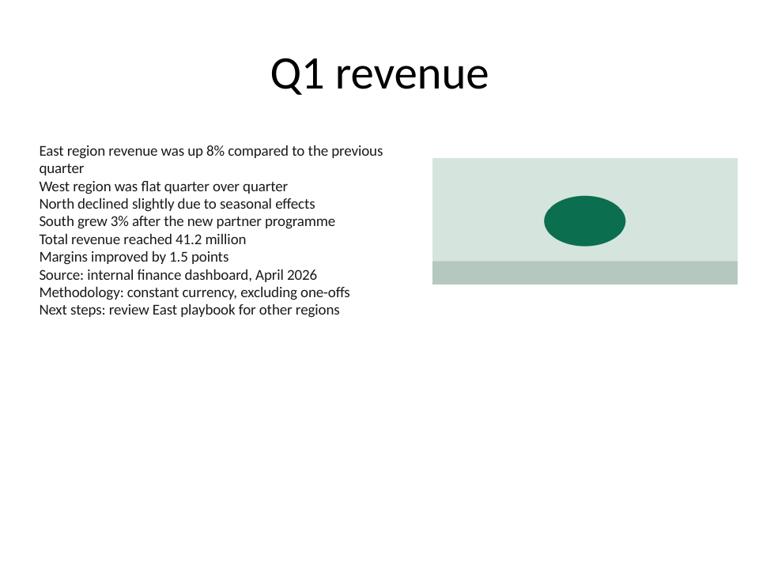
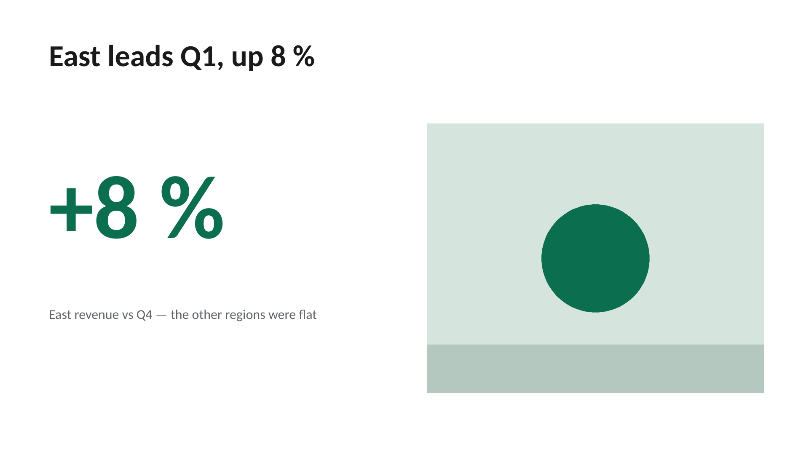

# Before / after

The same slide built twice by [`build_example.py`](build_example.py): once breaking the skill's rules, once
following them.

| Before | After |
|---|---|
|  |  |

| Rule | Before | After |
|---|---|---|
| Claim titles | "Q1 revenue" names a topic | "East leads Q1, up 8 %" makes the claim |
| ~10 visible words, body ≥ 18 pt | 9 bullets, 60+ words, 14 pt | Hero stat + one 24 pt caption |
| Crop, never stretch | A 3:2 photo forced into a wide box — the circle is now an ellipse | Cover-cropped to the box ratio (`scripts/cover_crop.py`) |
| Notes carry the depth | Sources, methodology and next steps crammed onto the slide | Key fact, facts, Q&A, pitfalls and source in the speaker notes |
| Full HD | python-pptx default 720 × 540 pt (4:3) | 1440 × 810 pt (`scripts/check_slide_size.py` passes) |

Regenerate the decks (they are not committed):

```bash
uvx --with python-pptx --with pillow python examples/before-after/build_example.py
```

The PNGs were rendered with LibreOffice (`soffice --headless --convert-to png`), whose fonts and line breaks
differ slightly from PowerPoint's. For real work, render with PowerPoint (`scripts/render_slides.py`).
